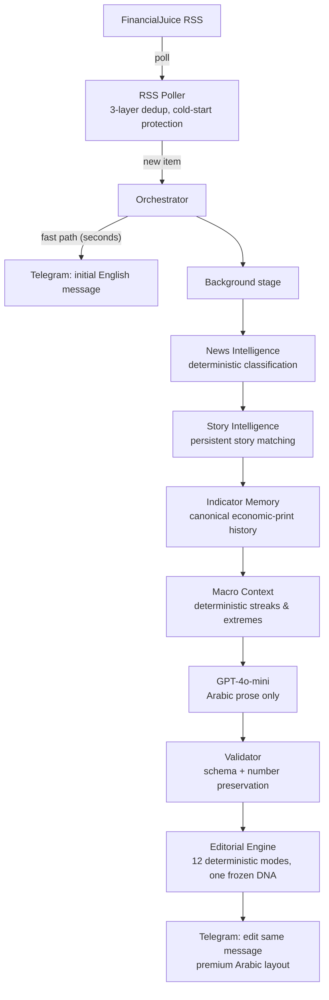

# Financial News AI Bridge

An Arabic financial-news intelligence platform. It ingests FinancialJuice headlines in real
time, understands them with deterministic engines (classification, story linkage, economic
history), uses AI strictly for Arabic newsroom prose, and publishes premium bilingual messages
to a Telegram channel — running 24/7 as a single lightweight service.

**The problem it solves:** Arabic-speaking traders and financial professionals have no newsroom
that covers global markets the way Bloomberg or Reuters covers them for English readers — fast,
accurate, and written by a desk that understands markets. Machine translation alone adds latency
and zero insight. This platform is a newsroom, not a translator: facts before interpretation,
numbers validated before publishing, silence over invention.

## Architecture



The **fast path never waits for intelligence**: the raw headline reaches subscribers in seconds,
then the same message is edited in place once analysis is ready. Every enrichment stage is
isolated — a failure in any of them degrades to the previous stage's behavior and can never
block publication.

## What makes it different

### Deterministic core, AI at the edge

The application — not the model — owns every operational fact:

| Decided deterministically (never by AI) | Decided by AI (language only) |
|---|---|
| Category, urgency, breaking status | Arabic headline & explanation prose |
| Country / currency / central bank / economic event | Financial interpretation (clearly framed as analysis) |
| Actual vs. forecast comparison (Decimal, unit-aware) | "What to watch" wording |
| Story identity & update/correction relationships | Weaving provided context into prose |
| Economic-print history, streaks, recorded extremes | |
| Message layout, icons, sections, hierarchy | |

The AI receives verified facts as authoritative context and is explicitly forbidden from
inventing history, numbers, or market reactions. Validation rejects any output that drops or
alters a number from the source headline.

### News Intelligence (deterministic classification)

Weighted-evidence engine with hard overrides and safe fallback: category, urgency, geography,
central banks, economic events, and Decimal-validated forecast surprises — computed locally in
microseconds, with word-boundary-safe vocabularies. When confident, it is authoritative; when
not, it says so instead of guessing.

### Story Intelligence (persistent memory of events)

Stories and their developments survive restarts in the database. New items are matched with
conservative weighted evidence (entities, events, geography, time windows) — a related story is
never assumed to be a duplicate, uncertainty never links, and regional bursts don't merge into
mega-stories. Confirmed updates render a «تطور سابق» context section built from the story's
last *published* development only.

### Indicator Memory + Macro Context (proprietary economic history)

Every validated economic print is stored under a canonical, wording-independent series identity
(`country | event | variant | unit-class`). Prints that can't be keyed with certainty are stored
honestly unkeyed — never guessed, never merged. On top of that history, a deterministic reader
computes forecast streaks, value streaks, within-our-records extremes, and revision links — with
minimum-evidence gates (≥3 prints for any streak claim, ≥6 for extremes) so the platform never
overclaims what its records can't support. "Highest since 2011"-style wording is structurally
forbidden until the records actually span it.

### Editorial Engine (one frozen visual DNA)

Twelve deterministic editorial modes (breaking, story update, economic data, central bank, …)
share one frozen message skeleton — modes may only set a badge, force the 🚨 icon, or reorder
gated sections. Semantic emoji registry, importance-aware length, data-before-interpretation,
and an honest verdict line («النتيجة: أعلى من التوقعات») rendered only when a real Decimal
comparison succeeded. The reader never sees internal metadata, confidence scores, or AI seams.

### Sample message (illustrative values)

```
📊 التضخم في منطقة اليورو يتباطأ إلى 2.4% في يونيو

أظهرت البيانات الأولية تباطؤ التضخم السنوي في منطقة اليورو إلى 2.4%،
متماشيًا مع توقعات الأسواق.

الفعلي: 2.4%
المتوقع: 2.4%
السابق: 2.6%
النتيجة: مطابقة للتوقعات

⚡ التأثير على الأسواق:
يعزز هذا التباطؤ توقعات خفض الفائدة الأوروبية في الاجتماع المقبل.

محايد • الأهمية: مهمة
المصدر: F.J. · 09:00 UTC
```

## Reliability engineering

- **Send-then-edit**: one notification per item; enrichment never delays delivery.
- **Three-layer duplicate prevention**: in-memory GUID set (DB-seeded), a database unique
  constraint, and SHA-256 content hashing.
- **Restart-safe everything**: stories, indicator history, and feed state persist; systemd
  restarts cannot double-publish or double-record (database-enforced idempotency).
- **Failure isolation**: every intelligence stage has its own try/except; a crash in story
  matching, indicator writing, or macro reading logs one warning and the item publishes
  normally.
- **Additive migrations only**, rehearsed on production-copy databases (upgrade → downgrade →
  re-upgrade with row-count verification) before every deploy.
- **Observability**: structured JSON logs (with HTTP-client logging suppressed so tokens can
  never leak), a `/health` endpoint, daily database backups, and `scripts/ops_report.py` — a
  one-command read-only operational snapshot.

## Technology

| Component | Technology |
|-----------|------------|
| Runtime | Python 3.12, single async process (FastAPI + Uvicorn) |
| Ingestion | FinancialJuice RSS |
| AI | OpenAI GPT-4o-mini via httpx (JSON mode, temperature 0.1) |
| Storage | SQLite + SQLAlchemy 2.0 async + Alembic |
| Delivery | Telegram Bot API (HTML parse mode) |
| Quality | pytest (228 tests) · ruff · black · mypy · GitHub Actions CI |
| Deployment | systemd service on a 1 GB cloud VM (~60 MB RSS in production) |

## Testing & CI

228 tests cover the pipeline end-to-end with mocked I/O: classification vocabularies against
real production headlines, story-matching evidence rules, canonical series identity, macro-gate
honesty (insufficient history must yield *nothing*), failure isolation (each stage crashed on
purpose), formatter freeze guarantees (byte-identical output when dark subsystems fail), and
migration round-trips. CI runs formatting, linting, typing, the full suite, a migration
up/down/up check, and a Docker build on every push.

## Local development

```bash
python3.12 -m venv .venv && source .venv/bin/activate
pip install -r requirements.txt
cp .env.example .env          # fill with your own test credentials
pytest                        # full suite, no network needed
python -m uvicorn app.main:app --port 8000
```

`.env.example` documents every variable. A Docker Compose path also exists
(`docker compose up -d --build`) for containerized runs. Operational procedures (deploy,
rollback, backups, incident response) live in [docs/RUNBOOKS.md](docs/RUNBOOKS.md).

## Deployment model

Production runs as a hardened systemd unit on a small cloud VM: `Restart=always`, secrets via
`EnvironmentFile` (never in git — see [SECURITY.md](SECURITY.md)), the health endpoint bound to
localhost only, and the database on persistent disk with daily backups. Deploys are a single
reviewed script: backup → fetch exact commit → migrate → restart, with a documented rollback
path. CI must be green before any deploy.

## Roadmap

- **Live now**: the full pipeline above (Phases 1–4B).
- **Accumulating**: indicator-history depth — macro context lines begin appearing naturally as
  weekly/monthly series reach their evidence gates.
- **Designed, awaiting data review**: narrative intelligence (cross-story themes) and a
  deterministic significance engine.
- **Externally gated**: verified market-reaction context (e.g., "gold moved X% in the hour
  after this print") — requires a licensed intraday market-data provider; the platform will not
  claim market moves it cannot verify, so this ships only when a trusted source is funded.

## Limitations (documented honestly)

- Economic-history claims are bounded by the platform's own recorded span — it will not assert
  multi-year records it hasn't witnessed.
- Country/event vocabularies are conservative: unrecognized indicators (e.g., some smaller
  economies, agricultural reports) are stored unkeyed rather than guessed.
- No market-price data yet (see Roadmap) — market-impact prose is expectation analysis, clearly
  framed as such, never a claimed reaction.
- Single channel, Arabic-first by design.

## License

MIT — see [LICENSE](LICENSE).
