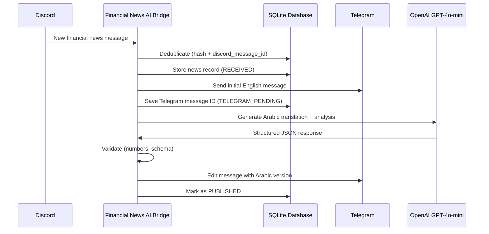

# Financial News AI Bridge

A production-grade service that listens to the FinancialJuice Discord channel, processes financial news with AI, and publishes professional Arabic translations and market analysis to a Telegram channel.

## Architecture



## Features

- **Real-time Discord monitoring** — Listens to the FinancialJuice channel only
- **Instant Telegram delivery** — Posts initial English message within seconds
- **Professional Arabic translation** — GPT-4o-mini with structured JSON output
- **Market analysis** — Importance, market bias, affected assets, and impact summary
- **Strict number preservation** — Validates all percentages, prices, and values are preserved exactly
- **Duplicate prevention** — Content fingerprint hashing + Discord message ID uniqueness constraint
- **Restart recovery** — Resumes interrupted processing after restart
- **Graceful shutdown** — SIGTERM handling, Discord disconnect, connection cleanup
- **Structured logging** — JSON logs, no secrets exposed
- **Health endpoint** — `/health` for platform monitoring

## Technology Stack

| Component | Technology |
|-----------|------------|
| Runtime | Python 3.12 |
| Web framework | FastAPI + Uvicorn |
| Discord client | discord.py 2.7+ |
| Telegram client | HTTP API via httpx |
| AI provider | OpenAI GPT-4o-mini |
| Database | SQLite + aiosqlite |
| ORM | SQLAlchemy 2.0 (async) |
| Migrations | Alembic |
| Retries | tenacity (exponential backoff) |
| Logging | structlog (JSON) |
| Deployment | Railway / Docker |

## Processing Pipeline

1. Start service and apply database migrations
2. Start Discord bot in background
3. Receive message from FinancialJuice Discord channel
4. Normalize and fingerprint the content
5. Check for duplicates (hash + message ID)
6. Store news record in database
7. Send initial English message to Telegram (fast path)
8. Save Telegram message ID
9. Call OpenAI with structured JSON schema
10. Validate AI output (required fields, number preservation)
11. Edit the same Telegram message with Arabic version + analysis
12. Mark database record as `PUBLISHED`

## Folder Structure

```
financial-news-ai-bridge/
├── app/
│   ├── api/health.py          # Health check endpoint
│   ├── config/settings.py     # Pydantic settings (env-based)
│   ├── constants/enums.py     # NewsStatus, NewsCategory, MarketBias
│   ├── database/connection.py # Async SQLAlchemy engine
│   ├── exceptions/            # Custom exception hierarchy
│   ├── log/logger.py          # structlog configuration
│   ├── main.py                # FastAPI app + lifespan + SIGTERM handler
│   ├── models/news.py         # SQLAlchemy models
│   ├── repositories/          # Database access layer
│   ├── services/
│   │   ├── ai/                # OpenAI provider
│   │   ├── discord/bot.py     # Discord client + message handler
│   │   ├── formatting/        # Telegram HTML formatter
│   │   ├── news/orchestrator  # Main processing pipeline
│   │   ├── telegram/          # Telegram publisher
│   │   └── validation/        # AI output + number validator
│   └── utils/                 # Hashing, text normalization
├── alembic/                   # Database migrations
├── prompts/
│   ├── translator.txt         # AI system prompt
│   └── glossary.txt           # Financial Arabic glossary
├── tests/                     # Pytest test suite
├── .env.example               # Template for environment variables
├── Dockerfile                 # Python 3.12 slim image
├── docker-compose.yml         # Local deployment with named volume
└── railway.json               # Railway deployment configuration
```

## Environment Variables

Copy `.env.example` to `.env` and fill in your values.

| Variable | Required | Description |
|----------|----------|-------------|
| `DISCORD_BOT_TOKEN` | Yes | Discord bot token from Developer Portal |
| `DISCORD_GUILD_ID` | Yes | Discord server (guild) ID |
| `DISCORD_SOURCE_CHANNEL_ID` | Yes | FinancialJuice channel ID to monitor |
| `DISCORD_APPLICATION_ID` | No | Discord application ID |
| `TELEGRAM_BOT_TOKEN` | Yes | Telegram bot token from @BotFather |
| `TELEGRAM_CHAT_ID` | Yes | Target channel or group ID (e.g. `-100...`) |
| `TELEGRAM_THREAD_ID` | No | Thread/topic ID for supergroups |
| `AI_PROVIDER` | Yes | `openai` (default) |
| `AI_MODEL` | Yes | `gpt-4o-mini` (default) |
| `AI_API_KEY` | Yes | OpenAI API key |
| `AI_BASE_URL` | No | Override for OpenAI-compatible API endpoint |
| `DATABASE_URL` | Yes | `sqlite+aiosqlite:///data/news.db` (default) |
| `LOG_LEVEL` | No | `INFO` (default) |
| `PORT` | No | `8000` (default) |
| `APP_ENV` | No | `production` |

## Local Setup

```bash
# Clone the repository
git clone https://github.com/zaidadaqqa/financial-news-ai-bridge.git
cd financial-news-ai-bridge

# Create virtual environment
python3.12 -m venv .venv
source .venv/bin/activate

# Install dependencies
pip install -r requirements.txt

# Configure environment
cp .env.example .env
# Edit .env with your credentials

# Start the service (migrations run automatically)
python -m app.main
```

## Docker Setup

```bash
# Build and start
docker compose up -d --build

# View logs
docker compose logs -f ai-bridge

# Restart
docker compose restart ai-bridge

# Stop
docker compose down
```

The SQLite database is stored in a named Docker volume (`db_data`) for persistence across restarts.

## Testing

```bash
# Run all tests
pytest

# Run with verbose output
pytest -v

# Type check
mypy app tests

# Format check
black --check .

# Lint
ruff check .
```

## Deployment on Railway

1. Connect your GitHub repository to Railway
2. Set all environment variables from `.env.example` in Railway's variable settings
3. Add a volume mount at `/app/data` for database persistence
4. Railway will use the `railway.json` configuration automatically

Start command: `python -m app.main`
Health check path: `/health`

## Database and Migrations

The service uses SQLite with Alembic for schema migrations.
Migrations run automatically at startup — no manual action required.

To manually apply migrations:
```bash
alembic upgrade head
```

To check migration status:
```bash
alembic current
alembic history
```

The database is **never deleted on startup**. Existing records are preserved.

If tables are accidentally dropped (e.g. by running tests against the production DB):
```bash
alembic stamp base && alembic upgrade head
```

## Logging

Logs are structured JSON emitted to stdout. Safe fields only — no tokens, API keys, or raw content.

Key log events to monitor:
- `Starting Financial News AI Bridge`
- `Database migrations applied successfully`
- `Discord bot starting in background`
- `Received new discord message`
- `Duplicate news detected by hash, skipping`
- `Telegram message sent`
- `Telegram message edited`
- `Successfully processed and published news`
- `AI validation/generation failed`
- `Shutting down gracefully...`

## Discord Setup

1. Create a bot at https://discord.com/developers/applications
2. Enable **Message Content Intent** under Bot → Privileged Gateway Intents
3. Invite the bot to your server with `View Channel`, `Read Messages`, and `Read Message History` permissions
4. Copy the bot token to `DISCORD_BOT_TOKEN`
5. Enable Developer Mode in Discord settings, then right-click the channel → Copy Channel ID

## Security Notes

- Never commit `.env` to version control (protected by `.gitignore`)
- Never commit `data/news.db` (protected by `.gitignore`)
- The `.env.example` contains only variable names, never real values
- Logs never output tokens, API keys, or sensitive API responses
- The Docker image does not copy `.env` or `data/` into the image
- The container runs as a non-root user (`appuser`)

## Troubleshooting

| Symptom | Likely Cause | Fix |
|---------|-------------|-----|
| `Discord LoginFailure` | Bot token expired or revoked | Regenerate token in Discord Developer Portal |
| `Telegram: chat not found` | Wrong `TELEGRAM_CHAT_ID` | Use numeric ID with `-100` prefix for channels |
| `Missing required field` | AI response schema mismatch | Check prompt in `prompts/translator.txt` |
| `Number X missing from AI output` | AI dropped a numerical value | The record will be marked `AI_FAILED` automatically |
| Database tables missing | Tests ran against production DB | Run `alembic stamp base && alembic upgrade head` |
| Port already in use | Another process on port 8000 | Change `PORT` in `.env` |

> **Warning:** Never commit credentials. If you accidentally expose a token, revoke it immediately from the relevant platform.
